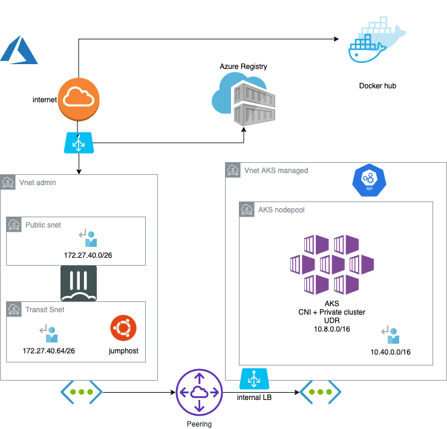
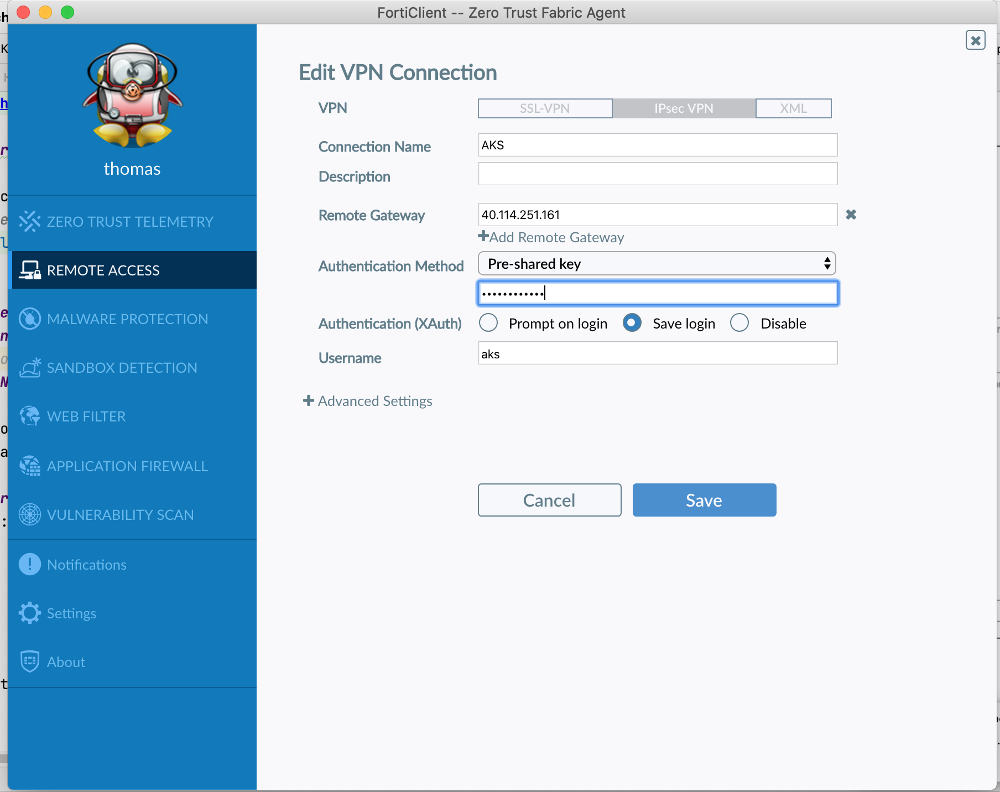

# Securing Azure managed Kubernetes (AKS)

This is an automated deployment of a Fortigate to secure an Azure managed Kubernetes (AKS) in full private setup API, nodes and CNI.
The goal is to set the scene to help understand and secure with Fortinet solutions an AKS environment and applications.
It has been kept simple (1 Fortigate) for education and cost perspective. 

Thanks to peering it can easily use more advanced Fortgiate on Azure solutions.
Contact a Fortinet representative for a completly scalable and automated solution.

# Bootstrap
Of course you need an Azure account with all necessary subscriptions and permissions.
Get the code
```shell
git clone https://github.com/fortinet-solutions-cse/secured-AKS-refarch
cd secured-AKS-refarch
```

If you don't have azure cli installed you can also use:
## Using provided docker image
```shell
docker run -v $PWD:/Azure/  -i --name az-aks-cli  -h az-aks-cli -t fortinetsolutioncse/az-aks-cli
```
If like me you have internal SSL inspection you use the same image.
(Curious check the code).

```shell
export FGTCA=$(base64 Fortinet_CA_SSL.cer -b0)
# this is for MacOS use -w0 on Linux
docker run -v $PWD:/Azure/ -e FGTCA -i --name az-aks-cli  -h az-aks-cli -t fortinetsolutioncse/az-aks-cli
```
## Using your own clis 

Depending on your environement you will need Azure cli and Ansible at least 2.9.
In addition you must install Fortigate support for Ansible:
```shell
ansible-galaxy collection install fortinet.fortios
```


## Script to set the architecture
```shell
az login
./Step1-FortigateAndNetworks.sh
```
This deploy a single fortigate VM with predefined setup. To login fgtadmin/Fortin3t-aks to the fortigate. It can be replaced by a more advanced Fortigate in HA, scalable transit etc..
Depends on Fortinet generic blueprint : https://github.com/40net-cloud/fortinet-azure-solutions/ 


```shell
./Step2-PrivateAKS.sh 
```
This deploy a jumphost VM in the transit area for convenience. 
A AKS with the following options:

- enable-private-cluster 
- network-plugin azure 
- generate-ssh-keys
- outbound-type userDefinedRouting

The result is a fully private setup (API and nodes) and ensuring there is firewall observability and prevention on outbound an inter-nodes traffic.


## Fortigate setup
Apply configuration to the FGT.
Replace the IP with the public IP of your fortigate. You may need to retry if experiencing a timeout.
```shell
ansible-playbook fgt-playbook.yaml -i hosts -e ansible_host=52.174.188.48
```

# Access the environment
## Connect to the jumphost

If you want to use the jumphost in this setup, You can either use Azure BASTION access (not setup by default) or there is a redirection on the Fortigate.
Find the Fortigate public IP (output of script or portal).
```shell
ssh azureuser@<FGT IP> -p 2222
```
Password is "Fortin3t-aks".
To setup the Jumphost once logged on it:
```shell
git clone https://github.com/fortinet-solutions-cse/secured-AKS-refarch
cd secured-AKS-refarch/jumphost
./configure-clis.sh 
./collect-configurations.sh
```

## VPN to Fortigate

The Fortigate has been setup (Ansible) to accept a VPN IpSec to the environment. (recommended)
Setup Forticlient IPSec client on your laptop with the public IP of the Fortigate:
- psk: Fortin3t-aks
- user: aks
- password: Fortin3t-aks


# Use AKS
