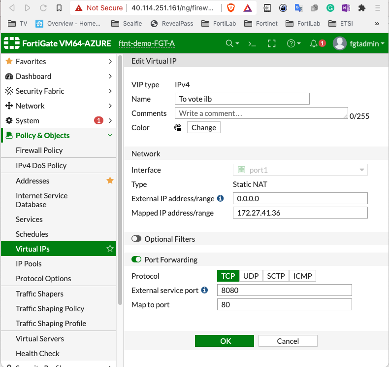
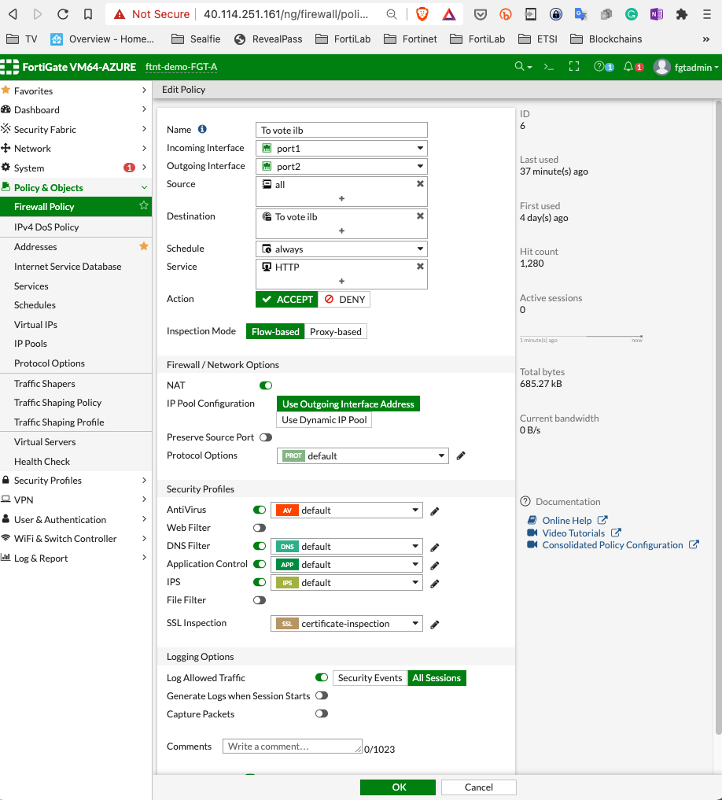
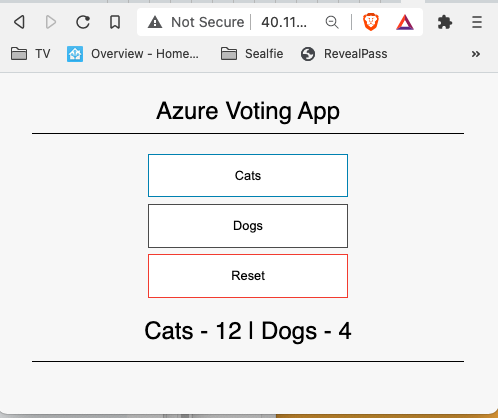
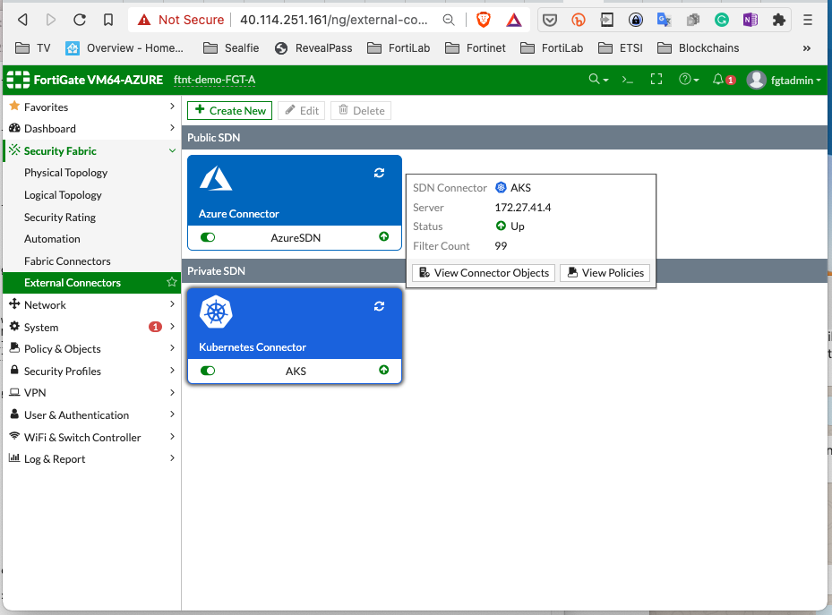
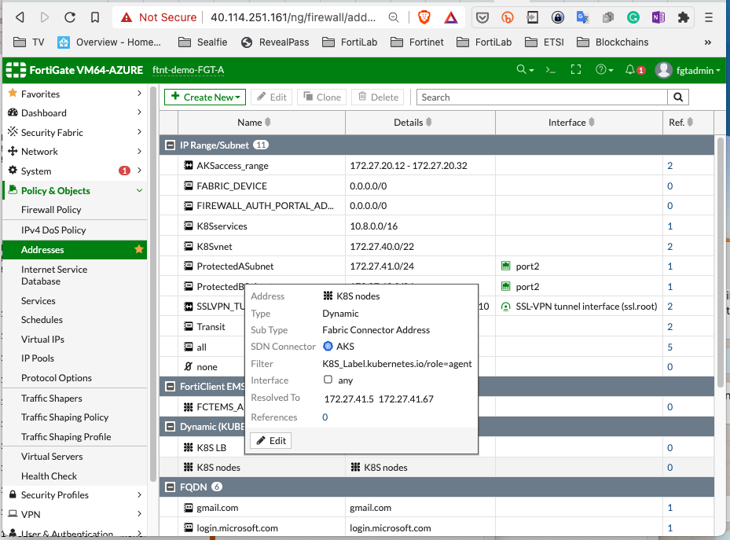
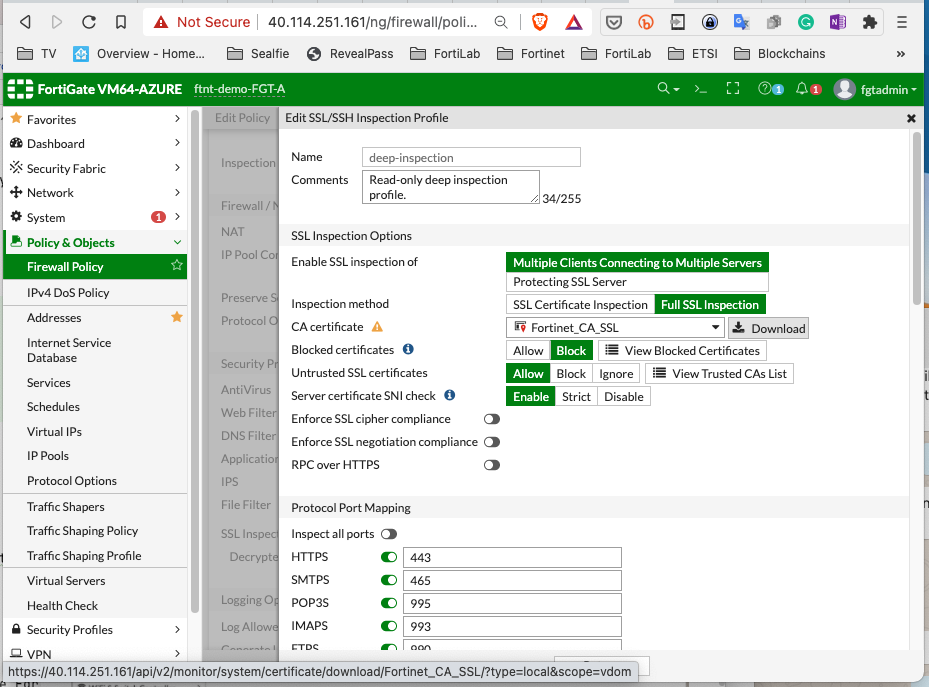
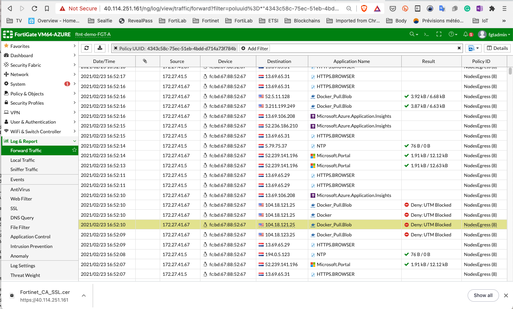
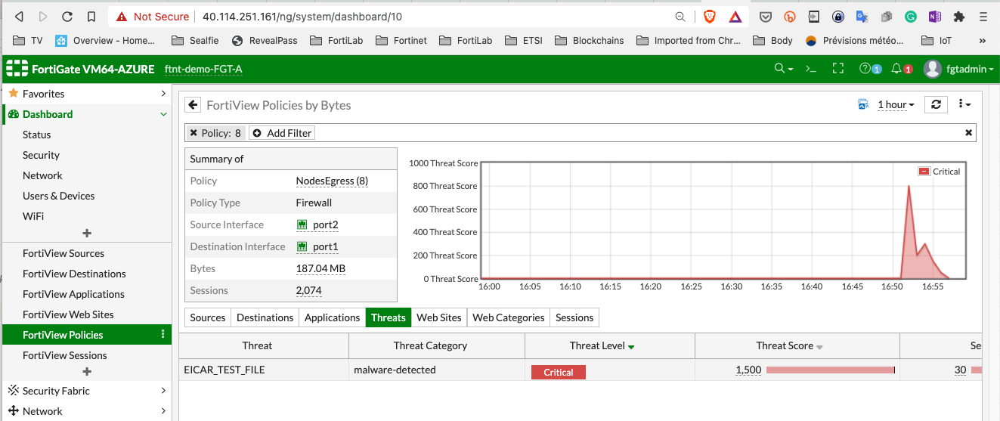

# Hands on demos

This document simple examples that are ready to use to test the differents protections or this Reference Architecture and capabiliites of the Fortigate to protect the cluster, apps and app traffic.

This is made to be fully compatible with AKS Tutorial and just add the security checks in-traffic provided by Fortigate.
You can follow the Tutorial with or without this refarch.


## Simple application internal LB and VIP

In applications folder you will find a ready to use azure voting app example based on Azure AKS tutorial.
Simply run
```shell
kubectl apply -f applications/voting-app.yaml
```
You can check the yaml and see that we use the internal loadbalancer.

As a result once deployed:
```shell
azureuser@ftnt-demo-jumphost:~/secured-AKS-refarch$ kubectl get pods,svc
NAME                                    READY   STATUS    RESTARTS   AGE
pod/azure-vote-back-6bdcb87f89-dt7cc    1/1     Running   0          4d10h
pod/azure-vote-front-5d6579c644-jwq5c   1/1     Running   0          4d10h
pod/azure-vote-front-5d6579c644-p4js9   1/1     Running   0          4d10h

NAME                       TYPE           CLUSTER-IP    EXTERNAL-IP    PORT(S)        AGE
service/azure-vote-back    ClusterIP      10.8.112.42   <none>         6379/TCP       4d10h
service/azure-vote-front   LoadBalancer   10.8.21.213   172.27.41.36   80:30924/TCP   4d10h
service/kubernetes         ClusterIP      10.8.0.1      <none>         443/TCP        6d16h
```

In that case the IP to target is 172.27.41.36

Then on the fortigate set a VIP and port forward:




Add a firewall policy



Of course adapt to your IP.

Using cli:
```shell
config firewall vip
    edit "To vote ilb"
        set mappedip "172.27.41.36"
        set extintf "port1"
        set portforward enable
        set extport 8080
        set mappedport 80
    next
end
config firewall policy
    edit 6
        set name "To vote ilb"
        set srcintf "port1"
        set dstintf "port2"
        set srcaddr "all"
        set dstaddr "To vote ilb"
        set action accept
        set schedule "always"
        set service "HTTP"
        set utm-status enable
        set ssl-ssh-profile "certificate-inspection"
        set av-profile "default"
        set dnsfilter-profile "default"
        set ips-sensor "default"
        set application-list "default"
        set logtraffic all
        set nat enable
    next
end
```

You can now connect the http://<fgt IP>:8080 and it should like the following:



If using the VPN acces you can go directly to the internal load balancer IP.

To stress the system and see the Kubernetes autoscaling in action you can use:
```shell
 ab -r -s 120 -c 500 -n 120000 -p vote.txt -T application/x-www-form-urlencoded -k http://<fgt IP>:8080
```
Wait a bit and monitor your number of pods.

The fortigate can then easily do the usual protection, DoS, and block known bad sites, limit repetitions etc..


## Fortigate as a LoadBalancer

You can use the prototype code from https://github.com/fortinet/k8s-fortigate-ctrl to do even more advanced check 
on the fortigate. If commercially interested contact your Fortinet Rep. This one is alpha code.

Get the code an deploy the controller in K8S
```shell
git clone https://github.com/fortinet/k8s-fortigate-ctrl
cd k8s-fortigate-ctrl
kubectl apply -f fortigates.fortinet.com.yml -f lb-fgts.fortigates.fortinet.com.yml 
kubectl create namespace fortinet
kubectl apply -n fortinet -f serviceaccount.yaml -f ctrl-role.yml -f rolebinding.yaml 
kubectl  -n fortinet apply -f deployment.yaml
```
To verify you can do:
```shell
kubectl get fortigates.fortinet.com   fgt-az
NAME     STATUS      EXTERNALIP
fgt-az   connected   40.114.251.161
```

Deploy or update the voting app:
```shell
kubectl apply -f examples/voting-app-antiaffinity.yaml
```
The only difference for the LoadBlancer is the annotation to use Fortigate controller:
and look like this:
```yaml
---
apiVersion: v1
kind: Service
metadata:
  name: azure-vote-front
  labels:
    app: azure-vote-front
  annotations:
    lb-fgts.fortigates.fortinet.com/port: "90"
    service.beta.kubernetes.io/azure-load-balancer-internal: "true"
spec:
  type: LoadBalancer
  # may try nodeport type to see if works better for K8S connector
  ports:
  - port: 80
  selector:
    app: azure-vote-front
```

You can access the app using http://<FGT public IP>:90/

See the LB CRD feedback
```shell
kubectl get lb-fgt
NAME               STATUS   FORTIGATE
azure-vote-front   1/1      fgt-az
```
The status represent the number of active health checks on the FGT versus number of target servers.

You make the FGT LB a TLS endpoint
```shell
kubectl edit lb-fgts.fortigates.fortinet.com  azure-vote-front
```
in spec: section replace   lb-type: http with   lb-type: https 

This allow to edit the created policy to do for example antivirus checks on random files uploaded to the Cluster or more advanced ips rules on the ingress traffic.


### Tip
To have a nice monitoring of kubectl states
```shell script
watch -c "kubectl get pods,lb-fgt,svc -o wide|ccze -A"
```
Use the ab command presented earlier to trigger autoscaling.

## Advanced debugging
**DO not do this in production please**

Connect with ssh [AKS nodes ssh access](https://docs.microsoft.com/en-us/azure/aks/ssh) (for debug)
SSH access to nodes for debug

If not done already (jumphost) create a ssh keypair with ssh-keygen
If you deployed the windows nodepool you will need to change the kubectl run command from Azure page like this:
```shell
kubectl run -it  aks-ssh --image=debian --overrides='{"apiVersion": "v1", "spec": {"nodeSelector": { "beta.kubernetes.io/os": "linux" }}}'
```

## Nodes traffic

We now are going to enable the FGT K8S connector. You can go and do it yourself on th gui.
Or use:
```shell
./ConfigureK8SConnector.sh
```
You receive a list of CLI to copy paste on the Fortigate, we cloud easily do an ansible playbook also.
Once setup it should look like:



With the connector you can now create dynamic firewall objects.
````shell
config firewall address
    edit "K8S nodes"
        set type dynamic
        set sdn "AKS"
        set filter "K8S_Label.kubernetes.io/role=agent"
    next
end
````
Will create a dynamic list of the Nodes VM ip only:




We can now for example create a specific policy linked to applications stearing to the traffic initiated on the nodes:
**TODO*

## Antivirus

To have antivirus on the fortigate we must enable SSL inspection.
On the fortigate go to "ProtectedSubnets-to-Internet" policy (this is the Egress traffic):



Download the file "Fortinet_CA_SSL.cer" then upload/put it where you run clis.

To move to the jumphost:
````shell
scp -P 2222 Fortinet_CA_SSL.cer azureuser@40.114.251.161:
````

Then make all you nodes trust the CA
```shell
./ConfigureK8SnodesCA.sh ~/Fortinet_CA_SSL.cer 
```
Enable your Egress policy to use antivirus and deep inspection before next steps.

Test:
```shell
# a legite image:
kubectl run ub --image=ubuntu bash -it
```
Should work, you can exist and delete the pod.


With an image containing a virus (EICAR is harmless)
```shell
kubectl run eicar --image=fortinetsolutioncse/ubuntu-eicar bash -it
```
You can see the source code of this in the project.

The second one should failed (timeout) you can get more details with ```kubectl describe pod eicar```
And on the fortigate logs:



On fortiview panel in the fortigate:




